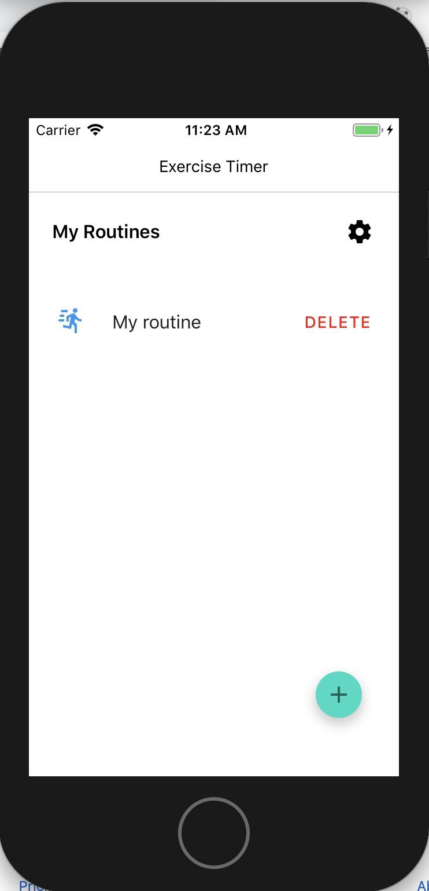
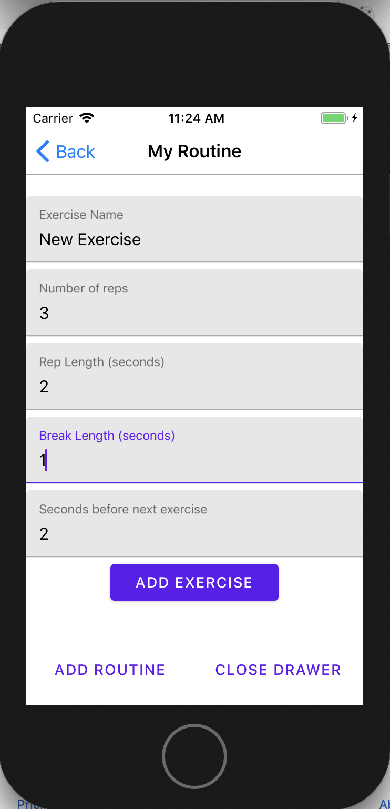
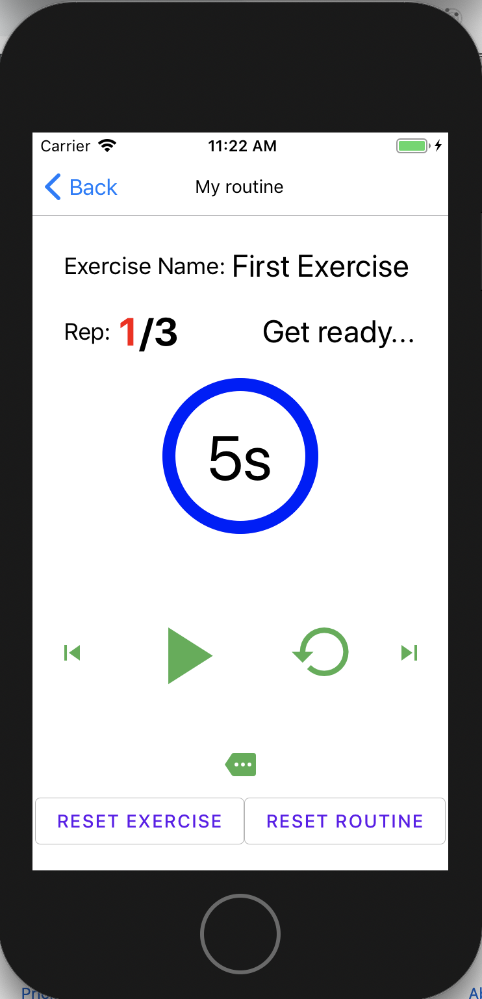

# :muscle: ExerciseTimer :watch:

> A React Native application for doing timed exercises without having to worry about a stopwatch
 
Between having a young child and working an office job, I have had my fair share of back problems. In spite of the theatrics, I have found this YouTube video: https://www.youtube.com/watch?v=ydT74SAts7M&list=PLVhCKQfUJK_0N9mxzd5Vql5tmzCTlp6w2&index=3&t=274s to be extremely helpful. The only problem is that it involves four timed exercises that are impossible to do correctly while holding a stopwatch. That is the inspiration behind this application.    

## :star: Features

- Simple form to create routines composed of exercises with a customizable rep length, break length, and time before the next one
- The app verbally alerts you when to to take a break, start a new rep, start a new exercise, and when the routine is finished
- Routines are modifiable and deletable after they have been created
- Possible to cycle through exercises, reset a particular exercise or the whole routine
- Customizable countdown time to get prepared before the routine begins

## :oncoming_automobile: Under the Hood

- TypeScript and React Hooks
- React-native-paper and react-native-vector-icons for the components and icons
- Styled-components to add css styling
- React-navigation to manage the flow of the app
- AsyncStorage to store all information locally
- React-native-sound to generate audible exercise cues even when the phone is in silent mode
- Formik to handle all the forms
- Animated library provided by react native to create sliding drawers  
- React-native-reanimated and react-native-svg to create the circular progress bar
- Fastlane to distribute the app to AppCenter for both Android and iOS


## :arrow_forward: Usage

> `For android`

```sh
yarn install

react-native run-android
```

> `For iOS`

```sh
yarn install

yarn install:pods

react-native run-ios
```

## :camera: Screenshots






